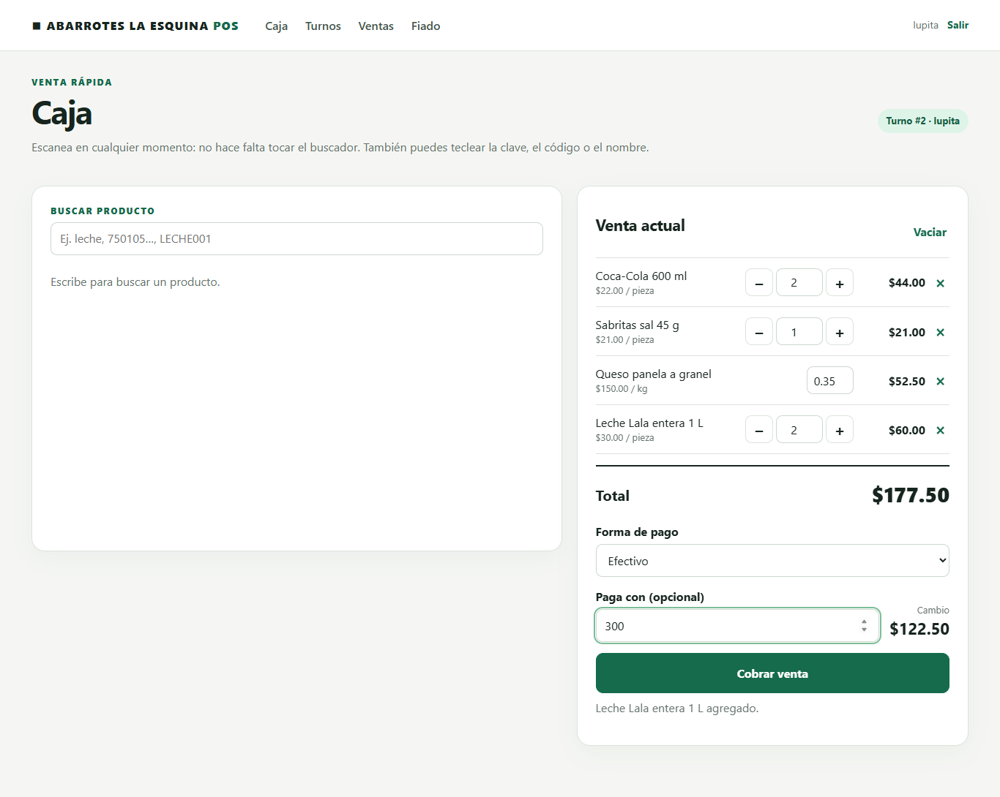
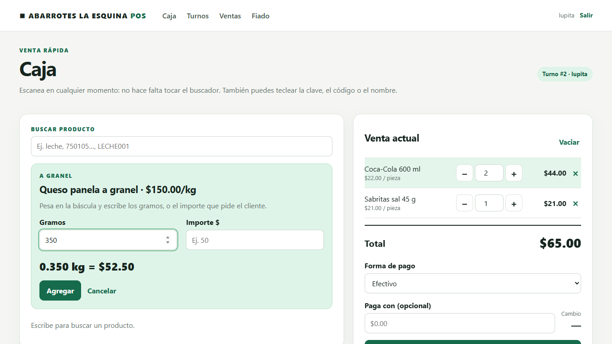
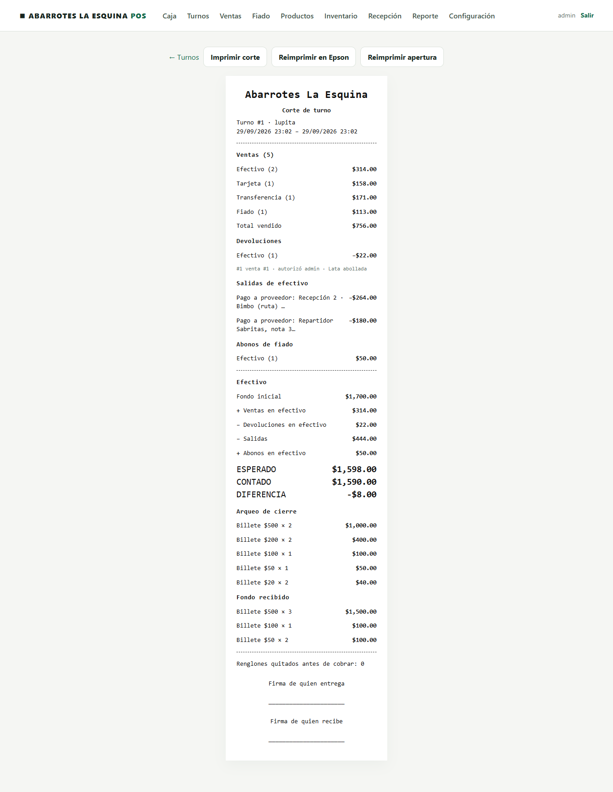
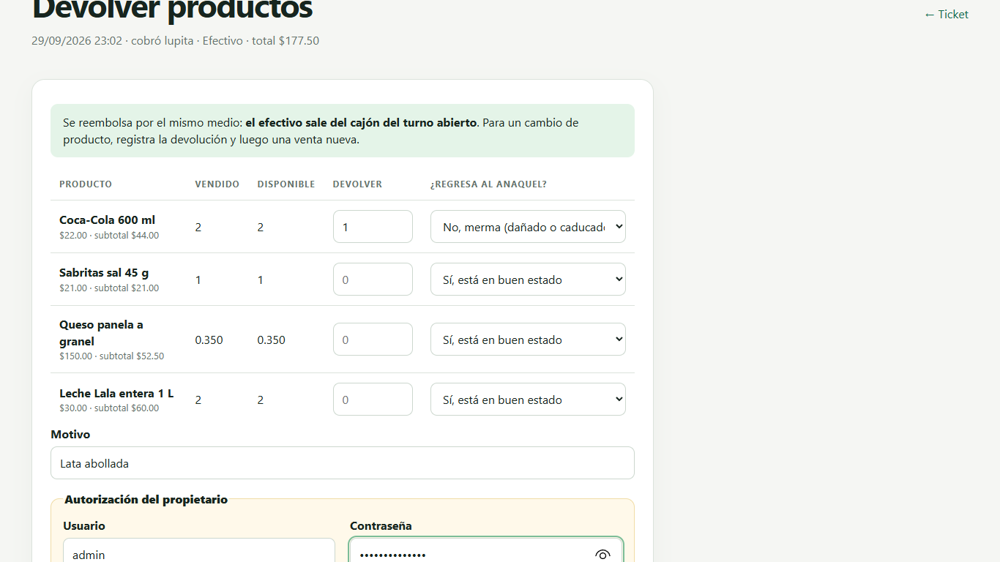
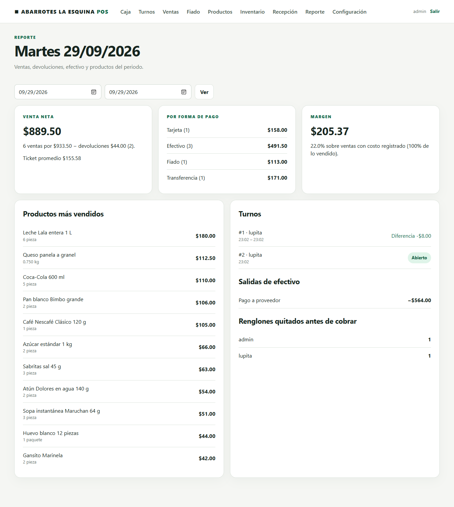
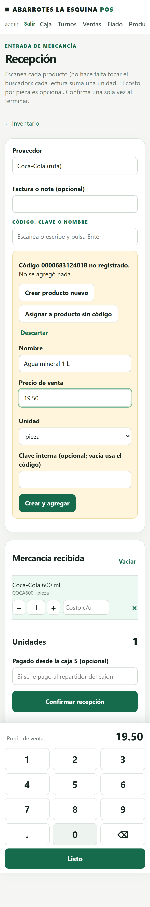
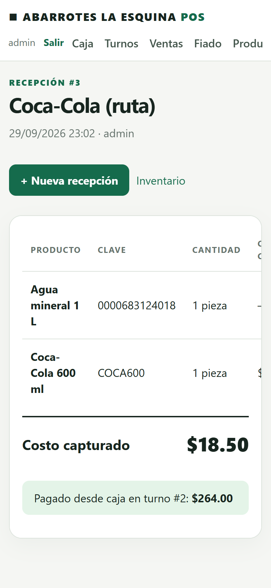

# Tienda POS

A small, offline-first **point of sale for a neighborhood grocery store** ("tienda de abarrotes"), built with Django and SQLite to run on an old laptop. It records every sale, delivery and stock count so differences between what was received, sold and counted can be explained. The interface is in **Spanish** for the people who run the store; code and documentation are in English.

<p align="center">
  
</p>

## Why

Small stores in Mexico usually run on a notebook: sales in a till, credit ("fiado") on paper, and no idea where the missing stock went. This project brings the practices that large retailers use — immutable sales, blind cash counts, supervisor-authorized returns, stock derived from movements — to a single laptop and a thermal printer, without a subscription and without depending on the Internet.

## Features

| | |
|---|---|
| **Scanner-first checkout** | Scans work wherever the cursor is, with beeps and highlighted lines; typed codes or name search (`coca 600`). Exact matches only: an unknown code can be created on the spot by the owner and comes back into the sale. |
| **Bulk items** | Cheese, ham and produce sold by grams from the scale or by amount ("50 pesos of ham"). |
| **Cash control** | Shifts opened and closed by counting bills and coins, **blind closing**, printed shift report, cash outs to pay delivery drivers. |
| **Returns** | Linked to the original ticket, authorized by the owner's password on the cashier's screen, refunded by the original method, restocked or written off. |
| **Store credit** | Registered customers with credit limits, payments and computed balances. |
| **Receiving on a phone** | Scan deliveries with a Bluetooth scanner paired to an iPhone or Android; an on-screen numeric keypad and − / + buttons work even when iOS hides its keyboard. |
| **Inventory** | Stock is the sum of movements; counts record differences and are adjusted only with authorization. |
| **Reports** | Sales history with filters, daily report with best sellers and margin, lines removed before charging. |
| **Printing** | ESC/POS over the network (verified on an Epson TM-T88V) for tickets, shift openings and shift reports, with accents; browser printing as fallback. |
| **Safe by design** | Server-side pricing, idempotent requests (retries never double-charge), daily verified backups. |

## Screenshots

| Checkout, bulk item by grams | Shift report |
|---|---|
|  |  |
| **Return with owner authorization** | **Daily report** |
|  |  |

<p align="center">
  
  &nbsp;
  
</p>

More in the [user guide](docs/user-guide.md).

## Try it in two minutes

Requires Python 3.12+.

```bash
git clone https://github.com/upiita-Emma-d/offline-grocery-pos.git && cd offline-grocery-pos
python -m venv .venv
.venv/bin/pip install -r requirements.txt            # Windows: .venv\Scripts\pip install -r requirements.txt
.venv/bin/python manage.py migrate
.venv/bin/python manage.py seed_demo --owner-password admin-demo-1 --cashier-password caja-demo-1
.venv/bin/python manage.py runserver
```

Open <http://127.0.0.1:8000/> and sign in as `lupita` (cashier) or `admin` (owner). The demo store has 93 products, fake barcodes such as `0000000000017` (Coca-Cola) and `0000000000055` (cheese by weight), two credit customers and a closed shift to explore.

## Install it in a store

The target is a single laptop (a 2nd-gen Core i3 is enough) that is both server and register, with Windows 10/11 or Linux Mint.

```powershell
# Windows, in an administrator PowerShell
powershell -ExecutionPolicy Bypass -File scripts\windows\install.ps1 -PrinterHost 192.168.1.50
```

```bash
# Linux
bash scripts/linux/install.sh --printer-host 192.168.1.50
```

The scripts create the environment and a `.env` with a new secret key, prepare the database, ask for the owner account, start the server automatically (waitress), schedule a daily verified backup and add a desktop shortcut. Details in [installation](docs/installation.md) and [printer](docs/printer.md).

## Documentation

- [User guide](docs/user-guide.md) — every screen, with screenshots
- [Guía rápida de caja](docs/guia-rapida-caja.md) — printable Spanish cheat sheet for the cashier
- [Installation](docs/installation.md) — laptop requirements, Windows and Linux setup, fixed IPs, updates
- [Printer](docs/printer.md) — finding the Epson, configuration, test page
- [Operations](docs/operations.md) — backups, restore, logs, troubleshooting
- [Operating rules](docs/operating-rules.md) — the business rules the code enforces
- [Architecture](docs/architecture.md) — design, domain model, invariants, Spanish ↔ code glossary
- [Decision log](docs/decision-log.md) and [ADRs](docs/adr/)
- [Roadmap](docs/roadmap.md)
- [Development](docs/development.md) — tests, demo data, browser walkthrough

## Tech

Django 5.2 LTS · SQLite · waitress · WhiteNoise · vanilla JavaScript (no build step, no CDN) · Playwright for the browser walkthrough.

```bash
python manage.py test     # money, stock, idempotency, permissions, closing and printing
```

## Status

Pilot-ready. Before relying on it for real money: install on the store laptop, load the real catalog, do a signed initial count, and rehearse a restore from backup. Invoicing (CFDI), taxes and discounts are out of scope for now. See the [roadmap](docs/roadmap.md).
