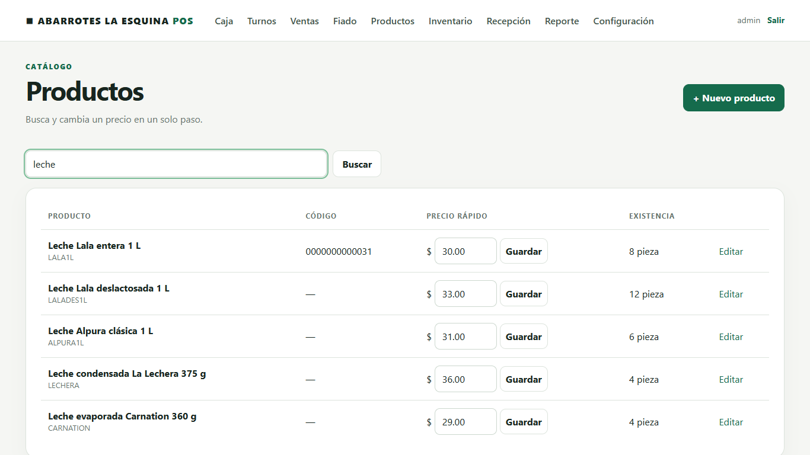

# User guide

The screens are in Spanish because the people running the store read Spanish; this guide explains them in English. Screenshots come from the fictitious demo store (`seed_demo`). A printable Spanish cheat sheet for the cashier is in [guia-rapida-caja.md](guia-rapida-caja.md).

**Roles:** the **owner** (propietario) sees every menu. A **cashier** (cajera) sees Caja, Turnos, Ventas and Fiado.

## A cashier's day

### 1. Open the shift — *Turnos*

Count the float received by denomination: type how many bills and coins of each value there are, and the total adds up by itself. With a network printer, an opening slip prints with signature lines for whoever hands over and whoever receives the money.

Only one shift can be open at a time. The cash in the drawer is the responsibility of whoever opened the shift.

### 2. Sell — *Caja*

- **Scan** a barcode or **type** it and press Enter: each read adds one unit. An unknown code shows a warning and adds nothing.
- **Search by name**: type a few words in any order (`coca 600`) and tap the result.
- Change a quantity in the box; **×** removes a line. Removals are logged for the owner.
- **Paga con** shows the change to hand back (cash only).
- **Forma de pago:** Efectivo, Tarjeta, Transferencia or Fiado (store credit, then pick the customer).
- **Cobrar venta** saves the sale, prints the ticket and shows it on screen.

**Bulk products (a granel)** such as cheese, ham or produce open a small panel instead of adding 1 kg: type the **grams** from the scale, or the **amount** the customer asks for ("50 pesos of ham"). The server computes the exact price.

### 3. The ticket

**Nueva venta** goes back to Caja. **Imprimir ticket** prints through the browser; **Reenviar a Epson** reprints on the network printer with the same folio. **Devolución** starts a return.

### 4. Pay a delivery driver — *Turnos → Salida de efectivo*

When a driver (Bimbo, Coca-Cola, Sabritas…) is paid from the drawer, record it as **Pago a proveedor** with the amount and a concept. Otherwise the closing shows a shortage. Expenses and partial drops to a safe are recorded the same way.

### 5. Close the shift — *Turnos*

Count the drawer (float included) by denomination and press **Cerrar turno e imprimir corte**. The expected amount is **not** shown before counting (blind close). Then the shift report appears and prints:

Expected = opening float + cash sales − cash returns − cash outs + store-credit payments received in cash.

## Returns and exchanges — *Ticket → Devolución*

Choose how many units come back and whether each goes back to the shelf or is waste (damaged, expired), and write the reason. A cashier needs the **owner's username and password** typed on the same screen. The refund uses the original payment method: cash leaves the drawer, store credit reduces the debt, card and transfer are refunded outside the system. An exchange is a return followed by a new sale.

## Store credit — *Fiado*

The owner registers customers (name or nickname, optional phone and limit). At checkout choose **Fiado** and the customer; a sale above the limit is refused. Payments are recorded in the customer's page during an open shift; cash payments add to the drawer.

## Owner tasks

### Home

Current shift, recent sales, products below their minimum stock and **negative stock** (sold more than received: a missing receipt or a scanning mistake).

### Receiving goods with a phone — *Recepción*

Open the POS on any phone connected to the store Wi-Fi (`http://<laptop-ip>:8008/`) and pair the Bluetooth scanner with the phone. Type the supplier, then scan every item: each read adds one unit. The cost per piece is optional (it feeds the margin report). If the driver was paid from the drawer, type the amount in **Pagado desde la caja**.

An **unknown barcode** never adds a similar product. The owner can **create** the product right there or **assign** the code to an existing product that has no barcode yet, which is how the reference catalog gets its real barcodes.

 

Confirm once at the end. If the connection drops, pressing confirm again never duplicates stock, and an unconfirmed receipt is recovered after reloading the page.

### Counting stock — *Inventario*

Scan or search the product and type how many are physically there. The count records the difference but **does not change stock** until you press **Autorizar ajuste**. Only the latest count of a product can be adjusted.

### Catalog — *Productos*

Change a price in one step (the history is kept and old tickets never change). **Editar** opens the full product: SKU, barcode, name, unit (piece, kg for bulk, liter, pack), price, cost, minimum stock. **Dar de baja** removes it from checkout; it needs zero stock and a reason and can be reversed.

### Sales history and daily report — *Ventas*, *Reporte*

Filter sales by dates, folio, shift, cashier or payment method. The report shows net sales, the average ticket, totals by payment method, best sellers, margin where costs exist, shifts with their differences, cash outs and removed lines per cashier.

### Ticket text — *Configuración*

Store name, header lines (address, phone, hours) and footer message, with a live preview. They apply to the next ticket.

### Cashier accounts

`/admin/` → Users → Add user. Leave "Superuser status" unticked for cashiers.
